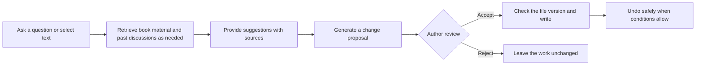
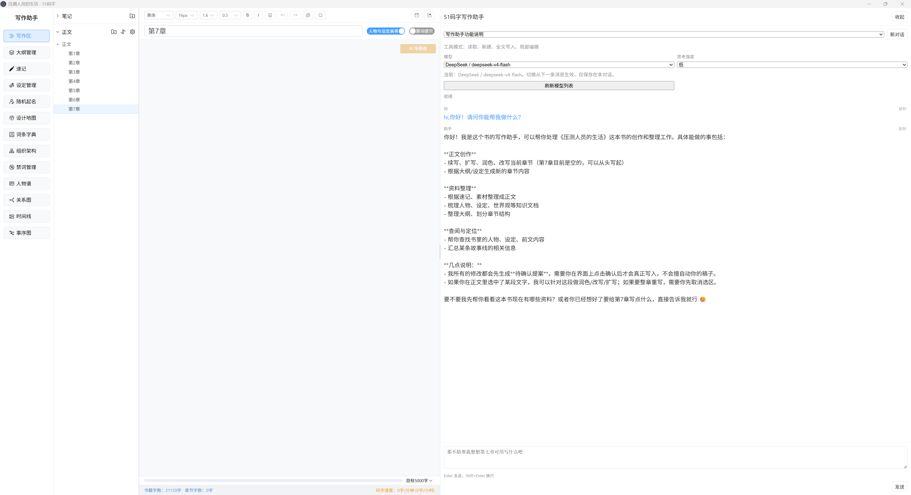
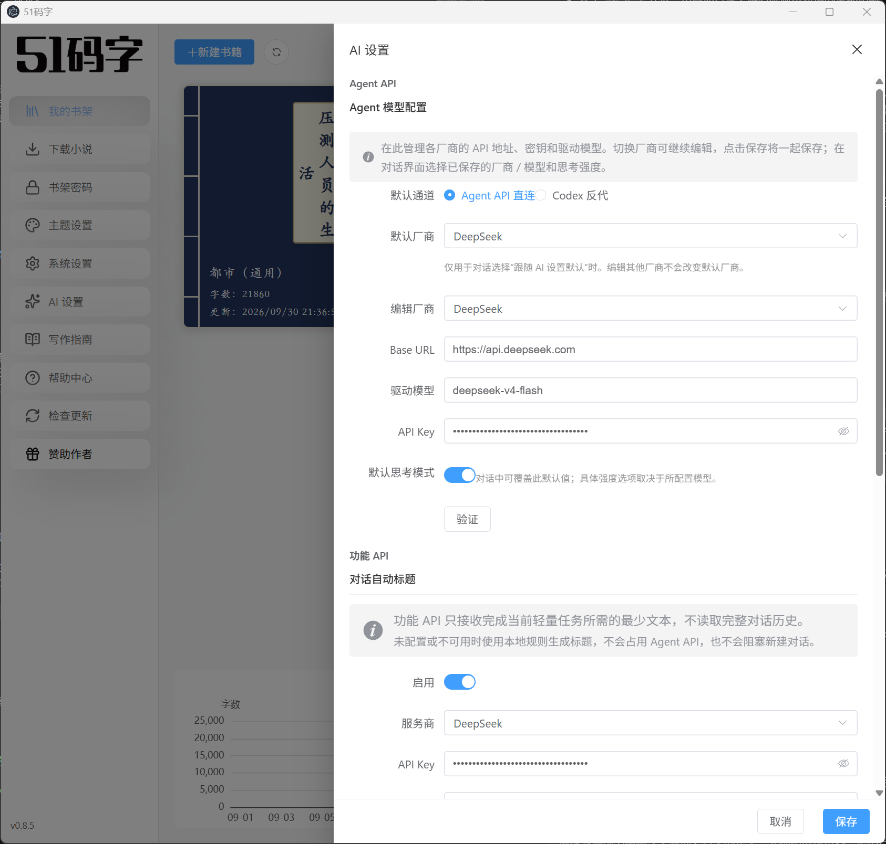
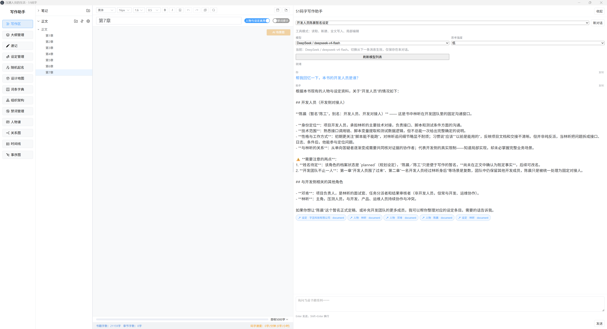
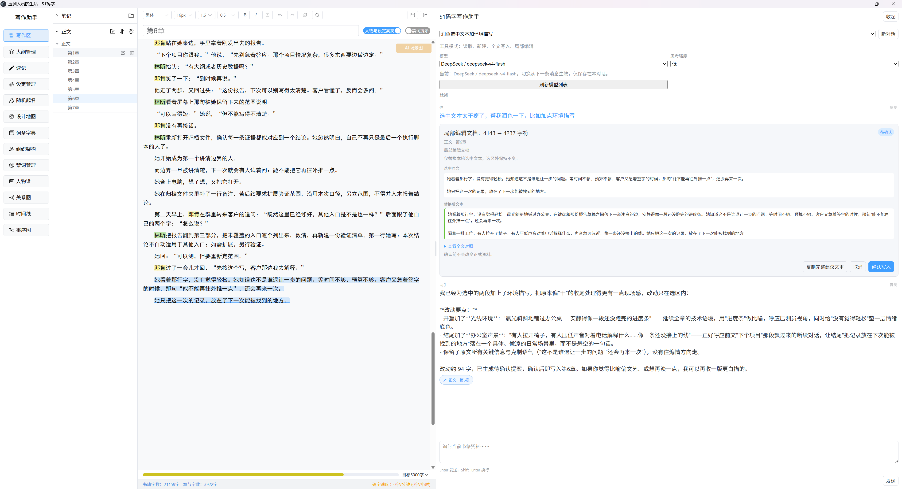
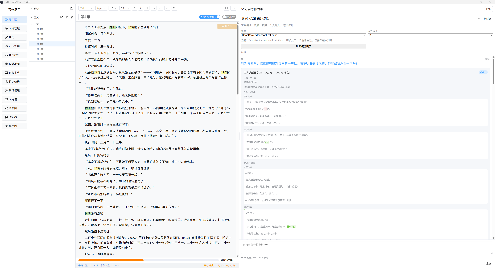
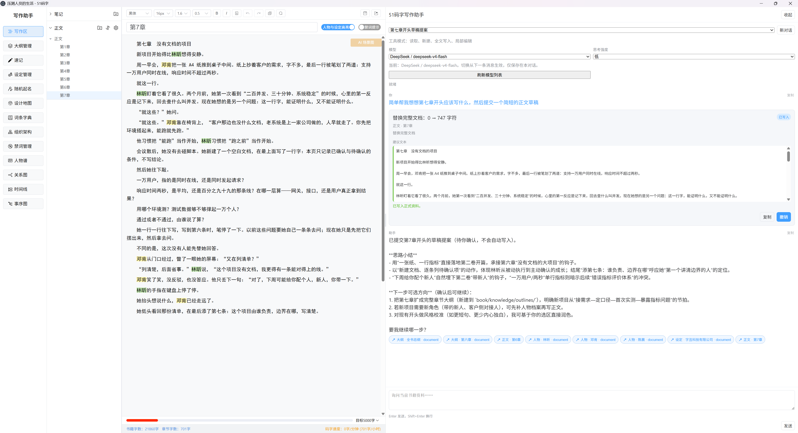
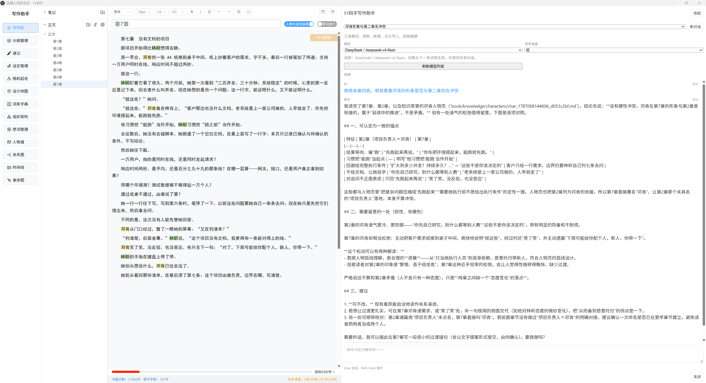
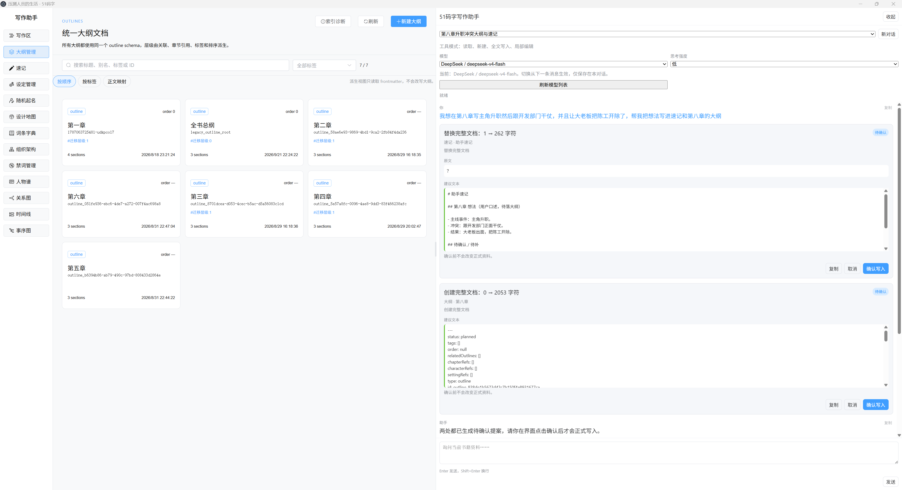

# 51mazi_chatbox

Current version: `v1.0.0` (public testing and validation release).

[English](README_EN.md) | [中文](README.md)

`51mazi_chatbox` is a novel-writing tool developed from the official [51mazi](https://github.com/xiaoshengxianjun/51mazi) `v0.8.5`. It retains the original project's local writing and creative tools, with three priorities: **sustained AI collaboration across an entire book, suggestions with verifiable sources, and author confirmation for changes to saved work.**

The initial goal was to bring the collaborative experience of agents such as `Codex` and `WorkBuddy` into a flexible writing editor. AI can consult the work, organize material, and propose reviewable changes within the author's authorized scope. To skip the technical details, go directly to the [Usage Guide](#usage-guide).

> [!IMPORTANT]
> This repository is a **public testing and validation version**. It is not an official 51mazi release and does not include every feature added in later upstream versions. Commercial promotions and sponsorship prompts retained in the interface come from upstream, in recognition of the original developer's work.

Quick navigation: [Usage Guide](#usage-guide) · [Basic Configuration](#basic-configuration) · [Common Use Cases](#common-use-cases) · [Feature Differences](#specific-differences-from-upstream-v085) · [Running from Source](#running-from-source) · [Current Limitations](#current-limitations)

## Why This Fork Exists

Long-form writing often presents three problems:

1. As chapters, characters, settings, foreshadowing, and discussions grow, authors may lose track of details, leading to contradictions, forgotten setups, or conflicting worldbuilding.
2. Getting inspiration from AI often requires maintaining large, constantly changing reference documents or repeatedly uploading the entire book. This takes time and is difficult to sustain.
3. For writers who do not write full-time, necessary but repetitive transitions, battles, or dialogue scenes can drain creative energy. AI can help draft and refine these passages.

Authors need an ongoing collaboration process centered on their work.

The project's file and Harness management systems draw on agent frameworks such as pi-agent. Using 51mazi's professional writing interface, this fork restructures AI collaboration, context reading, and change confirmation so that large language models can participate in everyday writing.

The agent can read and search book content and generate proposals to create or modify chapters, characters, settings, outlines, and quick notes. The workflow is “discussion → AI suggestions or drafts → author review → confirmed save.” There is currently no general-purpose tool for deleting saved documents.

This branch follows four principles:

1. **Each book is a collaboration space.** Chapters, characters, settings, outlines, notes, and discussions share one workspace. Switching modules does not require copying all the background again.
2. **Facts, plans, and discussions have distinct roles.** Saved chapters are the written work, outlines are plans, and conversation history is discussion. The system distinguishes sources and asks AI to identify its evidence. Authors still need to check conclusions.
3. **AI proposes; the author decides.** Changes become reviewable proposals, written only after author confirmation while the target version still matches.
4. **Authors retain control of their work.** Manuscripts, knowledge documents, conversations, and proposals are stored locally. Indexes can be rebuilt; maintenance does not depend on a particular model session.

## From a Question to a Saved Change



This reduces routine work while preserving the author's final control. Queries, discussions, and reviews can end with an answer; proposals are generated when changes are needed.

## Main Updates in This Branch

### 1. Book Workspace and Persistent AI Conversations

- Chapters, characters, settings, outlines, and notes are core content available to agent operations in one workspace.
- A collapsible, resizable sidebar lets conversations continue while switching features.
- Multiple conversations support characterization, plot planning, and reference organization.
- The application saves conversations, summaries, tool records, and proposals, preserving the creative process beyond individual model sessions.
- Characters, settings, and outlines use Markdown for direct editing and agent reading and citation.

### 2. Unified Book Document Tools

- AI uses `read`, `create`, `write`, and `edit`, with `list_files` for discovery. One protocol covers chapters, characters, settings, outlines, and notes.
- Material uses `book/...` virtual paths. Document tools do not accept drive letters or internal storage paths.
- `read` supports directory search, short continuation cursors, and batches of 1–12 files. Built-in `help/...` documents explain formats.
- `create` proposes new documents; `write` replaces entire documents; `edit` changes a selection or multiple passages in one document.
- Whole-document tasks, master outlines from notes, and chapter division check that sources have been fully read. Partial results must not be presented as complete synthesis.

#### Current Tool List

| Tool | Purpose | Main parameters | Important rules |
| --- | --- | --- | --- |
| `list_files` | Recursively list chapters, characters, settings, outlines, and notes | `path`, `cursor`, `maxChars` | Defaults to `book/`; explicitly list `book/conversations/` for history. Listings do not count as reading content. |
| `read` | Read files, browse directories, search, or read batches | `path`, `paths`, `cursor`, `query`, `maxChars` | `paths` accepts 1–12 files. Continue long reads with the short `nextCursor`. Directories, snippets, help, and history cannot alone establish confirmed facts. |
| `create` | Create a chapter, character, setting, outline, or the single notes document | `directory`, `content`; knowledge may include `basis/sources` | Pending proposal only. Directory must belong to the book and support the type; chapters require an existing volume. No saved file before confirmation. |
| `write` | Rewrite a chapter or replace a complete document | `path`, `content`; knowledge may include `basis/sources` | Fully read the same target version first. With a chapter selection, clear it or use `edit`. |
| `edit` | Replace the chapter selection or make local changes in one document | `path`, `edits`; knowledge may include `basis/sources` | With a selection, submit one complete `newText`. Otherwise use uniquely matching `oldText/newText` per edit. Read the target range first. |

#### Search and Previous Tools

There is **no standalone `search` or `search_book_knowledge` tool**. Search is integrated into `read`: pass a directory and `query`. For example, `read({ path: "book/", query: "missing key" })` searches chapters, characters, settings, outlines, notes, and conversations. Narrow scope with `book/chapters/`, `book/knowledge/characters/`, `book/knowledge/settings/`, `book/knowledge/outlines/`, `book/notes/`, or `book/conversations/`. Results provide snippets and paths; important originals still require `read`. This is **local retrieval within the current book and its history**. Web search is not yet integrated.

The previous 10 specialized Harness tools have been consolidated into 5 general document tools:

<details>
<summary>Expand to see previous tool mappings and capability changes</summary>

| Previous tool | Current entry point | Capabilities and changes |
| --- | --- | --- |
| `list_book_structure` | `list_files`, or directory browsing with `read` | Discovery remains; grouped/flat modes and rich short metadata such as tags, aliases, status, and sections are no longer directly exposed. |
| `search_book_knowledge` | `read({ path, query })` | Hybrid retrieval and history search remain. Paths define scope; literal/regex/semantic/hybrid selectors, filters, and result-count parameters are removed. |
| `read_book_source` | `read({ path })`, `read({ paths })`, `read({ cursor })` | Single, batch, and paginated reads remain; direct line/heading/section navigation parameters are removed. |
| `read_book_backlinks` | Read the returned `views.backlinks` path with `read` | Explicit references and weak matches remain, capped at 100 entries. `includeWeak` and `limit` are removed. |
| `read_outline_context` | Read returned `views.outlineContext` with `read` | Related outlines, chapters, characters, and settings remain; backend controls depth, counts, and character budgets. |
| `propose_chapter_edit` | `write` / `edit`; `create` for new chapters | Whole-chapter replacement, selection editing, multiple local edits, and creation. |
| `propose_character_edit` | `create` / `write` / `edit` | Retained through unified Markdown proposals. |
| `propose_setting_edit` | `create` / `write` / `edit` | Retained through unified Markdown proposals. |
| `propose_outline_edit` | `create` / `write` / `edit` | Retained; ordering and associations are edited in content rather than separate operation names. |
| `propose_quick_note_change` | `write` / `edit` | Append, insert, replace, and archive remain. One `edit` moves a complete block into `## 归档` (Archive). |

Old names are no longer registered, so old calls cannot be replayed directly. Most capabilities remain, but advanced search parameters, precise navigation, and some specialized parameters have been reduced. Old `archive_document` has no equivalent: `edit` can set `status` to `deprecated`, but does not move, delete, or actually archive the file.

</details>

`create`, `write`, and `edit` are **proposal tools**. Success means content is frozen for review, rather than saved. The author must inspect and confirm the diff. Rejection leaves files unchanged. Undo requires the applied target version to remain unchanged.

Tools use virtual paths:

```text
book/                                      # Currently bound book
├─ chapters/<volume>/<chapter>.txt          # Chapters
├─ knowledge/characters/<document ID>.md    # Characters
├─ knowledge/settings/<document ID>.md      # Settings
├─ knowledge/outlines/<document ID>.md      # Outlines
├─ notes/quick-notes.md                     # Assistant notes
└─ conversations/<conversation ID>.md      # Read-only history

help/index.md                              # General guide
help/characters.md                         # Character format
help/settings.md                           # Setting format
help/outlines.md                           # Outline format
help/chapters.md                           # Chapter rules
help/notes.md                              # Note rules
help/references.md                         # Sources and stable references
```

Knowledge documents identify their basis:

- `basis=source_grounded`: sources actually read this turn whose versions still match; `sources` contains corresponding `book/...` paths.
- `basis=creative`: explicitly requested creation without `sources`, avoiding presenting ideas as existing facts.
- Chapters and notes do not use `basis/sources`.

Workflow: `list_files` → `read` and version checks → `create/write/edit` → author acceptance or rejection → undo when possible.

### 3. Book Material, Sources, and Past Discussion Retrieval

- Search all core material and history. Discussions are unconfirmed and cannot independently establish facts.
- Chapter reads may return candidate characters/settings for further reading; candidate lists are not read evidence.
- Answers retain versioned sources for checking originals and avoiding outdated evidence.
- Stable references, outline/chapter associations, backlinks, and outline context views are supported.
- Source-based knowledge requires material read this turn with matching versions; creative material is marked separately.

### 4. Freezing, Reviewing, Confirming, and Recovering Proposals

- Core documents share proposals; creation, replacement, and editing do not directly change saved files.
- Local edits show colored changes and context; selections show original/replacement text. Full comparison can be expanded.
- Proposals freeze baseline and complete candidate, recording versions, hashes, sources, and expiry.
- Writes check response state, unsaved drafts, proposal version, integrity, and file baseline to protect newer edits.
- Undo snapshots precede writing. Undo requires a matching applied version. Interrupted writes are recovered or marked as conflicts based on disk state.
- Confirmation credentials bind window, book, conversation, proposal version, and candidate. Expired/cross-window operations are rejected.

### 5. Flexible Markdown Knowledge Documents

- Characters, settings, and outlines use independent Markdown files.
- Beyond required identifiers, metadata, and references, works retain custom fields and structure.
- Tags, ordering, related outlines, and chapter references replace a mandatory hierarchy.
- Indexes support diagnostics and rebuilding; sources remain directly readable local files for backup.

### 6. Models and API Configuration

- Codex App Server compatible and explicitly configured OpenAI-compatible API routes are supported.
- Presets include Cloudflare Workers AI and Mistral AI. Providers retain independent settings; edited/default providers are distinct.
- Conversations choose models and reasoning effort, with levels reflecting known DeepSeek/GPT family capabilities.
- Saved direct models remain when catalogs fail; manual refresh is available. Validation does not save settings.
- Potentially truncated tool calls are not executed at output limits; one safe retry is possible within budget/time.
- Lightweight tasks such as titles can use a separate Function API; failures do not silently switch services.

> Listed providers/models do not certify all combinations. Agent models must support standard tool calling; verify through testing.

### 7. Portable Data and Application-Wide Configuration

- Chat, Function API, DeepSeek, Tongyi Wanxiang, Gemini, Doubao, and image-provider settings use `BookList/.51mazi/api-config.json`.
- Settings are application-wide, without per-book re-entry.
- Switching libraries loads destination settings, or can carry current settings if none exist.
- Migration uses backups, atomic writes, and read-back validation; old API entries are removed only after success.
- Library-root `.51mazi` is excluded from book recognition, manuscript export, and retrieval.

### 8. Book Isolation and Reliable Saving

- Windows bind their current book; conversations, tools, proposals, and events check that scope.
- Tools reject drive letters, UNC, `..`, symlinks, junctions, hard links, and out-of-book paths. Book `.51mazi` is not directly exposed.
- Unsaved state uses the last successful snapshot; delayed saves do not incorrectly mark newer typing or switched chapters as saved.
- Writes add UTF-8 checks, conflict protection, atomic replacement, post-processing rollback, and diagnostics without manuscript text.
- Per-book `.51mazi/stats/word-stats.json` uses serialized updates and idempotent baselines; old library-root statistics can migrate.
- Highlighting includes characters, settings, and saved aliases.

## Specific Differences from Upstream `v0.8.5`

“Original” means the original software developer's 51mazi `v0.8.5`, rather than another fork or preview with a chat assistant. Some modules are replaced by whole-book collaboration workflows.

| Feature | Original `v0.8.5` | This branch | Practical change |
| --- | --- | --- | --- |
| AI entry points | Separate polishing, continuation, outline generation | Persistent sidebar and multiple conversations | Discuss the work continuously without repeating background. |
| Context | Temporarily assembled per task | List, search, batch-read chapters, knowledge, notes, history | Read as needed and cite originals. |
| Chapter changes | Copy or confirm generated text | `write` whole chapters; `edit` selections/local passages | Diff review and version/draft/hash checks before writing. |
| New chapters | Manual creation then generated content | `create` proposals | No file before confirmation or empty file after rejection. |
| Characters | Full profile forms and multi-image galleries | Markdown, references, avatars | Flexible fields; original forms/galleries removed. |
| Settings | Categorized forms and dedicated generation | Markdown `kind`, tags, aliases, custom sections | Flexible expansion, reading, and citation. |
| Outlines | Tree, compact display, AI draft workbench, generation | Markdown order, tags, related outlines, chapter references | No forced hierarchy; tree editor/draft workbench removed. |
| Reliability | Context without unified source status | Saved chapters, plans, notes, discussion distinguished | History alone cannot prove facts; source-based/creative knowledge distinguished. |
| Models | Dedicated text APIs such as DeepSeek; image services | Codex App Server or OpenAI-compatible Agent API | Local/remote services and per-conversation models/effort. |
| Safety | Per-feature confirmation/saving | Frozen proposals, window credentials, checks, undo, recovery | File/editor changes invalidate old proposals. |
| Scope | Modules operate on book data directly | Window/book-bound `book/...` tools | Reject cross-book paths and link/path bypasses. |
| Highlighting | Characters | Characters, settings, saved aliases | Recognize places, organizations, items, and other entries. |
| Transfer | Library manuscripts; separate API settings | Book `.51mazi` collaboration; library `.51mazi` APIs | Complete library carries major collaboration data/settings. |

Multiple books, volumes/chapters, autosave, search/replace, statistics, forbidden-word warnings, covers/scene images, maps, relationships, timelines, event diagrams, organization charts, dictionaries, random names, export, and bookshelf/book passwords remain. AI collaboration, characters, settings, and outlines are the main replacements.

> [!WARNING]
> Original full profiles/galleries, categorized setting forms, compact tree outlines, AI draft workbench, and dedicated code are removed. **Original characters, settings, tree outlines, and drafts do not automatically migrate to Markdown.** First test old works using copies.

## Inherited Creative Tools

- Multiple-book management and chapter editing.
- Local/AI covers.
- Maps, relationship graphs, timelines, event sequence diagrams, organization charts.
- Dictionaries, random names, notes.
- Manuscript export.
- Bookshelf and book passwords.

Availability is determined by current source and interface.

## Data Storage, Transfer, and Privacy

```text
BookList/
├─ .51mazi/
│  └─ api-config.json          # Shared API configuration
└─ <book name>/
   ├─ mazi.json
   ├─ 正文/                   # Manuscript directory
   ├─ knowledge/
   │  ├─ characters/
   │  ├─ settings/
   │  └─ outlines/
   └─ .51mazi/
      ├─ harness/v1/           # Conversations, memory, tool records, frozen proposals, undo
      ├─ notes/                # Assistant notes
      └─ stats/                # Book statistics
```

Between your devices, copy **complete `BookList`, including hidden `.51mazi` directories**, then select it on the new device. This transfers books, collaboration data, and in-app APIs together.

- `api-config.json` contains credentials; do not publish on GitHub or with manuscripts.
- Exports exclude API settings. Sharing full libraries requires excluding `.51mazi` configuration and migration backups.
- External Codex installation, login, and settings require separate handling.
- Unsaved drafts are outside transfer guarantees.
- Save logs live in application data, not `BookList`. They omit manuscript text but may contain names, paths, hashes, and errors; inspect before public reports.
- Data is local by default. Remote AI receives selections, excerpts, and context required by requests. Read provider privacy policies.

## Running from Source

### Requirements

- Node.js and npm.
- Windows, macOS, or Linux development environment.

### Install and Start

```bash
npm ci
npm run dev
```

1. Choose/create a library such as `BookList`.
2. Create a test book to learn documents and confirmation.
3. Configure your model/image services if needed.
4. Check book/model when first using the assistant; “Read / Create / Whole-document Write / Local Edit” lists available operations.
5. Back up old works; do not test on your only original.

### Build

```bash
npm run build

# Platform-specific installers
npm run build:win
npm run build:mac
npm run build:linux
```

### Pre-release Verification

```bash
npm run verify:release
```

Runs static checks, offline regressions, and production build sequentially. Real models, permissions, installer upgrades, and cross-platform behavior need separate acceptance testing.

## Current Limitations

- Early source preview without guaranteed production stability.
- Markdown source editing predominates; accessible forms/WYSIWYG need improvement.
- No automatic migration of original characters, categorized settings, tree outlines, or drafts.
- Old-tool proposals are history only. Regenerate pending ones; manually check files for old proposals interrupted during writing.
- Full-read/source/version/draft checks may require more reading or saving first to protect writes.
- Symlinks, junctions, and hard links may be rejected.
- Codex-compatible mode keeps a read-only sandbox, but native reads are not guaranteed to stay within the book. Project path checks and write confirmation remain. For strict local read scope, use an OpenAI-compatible Agent API exposing only registered function tools; remote services still receive required excerpts/context.
- Tool-calling/format compatibility varies; not all listed combinations are certified.
- Based on `v0.8.5`; later upstream features are not automatically included.
- Keep an independently recoverable backup before migration or AI writes.

## Planned Improvements

- **Hundred-chapter logic review**: Cross-chapter character, setting, timeline, foreshadowing, and fact checks for 100+ chapters.
- **Web knowledge search**: External retrieval distinguishing web sources, saved book material, and discussions.
- **World-truth rule markers**: Mark world facts/rules without implying characters know them.

## Contributing and Feedback

Use GitHub Issues for problems, experiences, and design discussion. The fork's author is not a professional developer; iteration follows practical writing needs. Verified technical contributions, including AI-assisted improvements, are welcome.

Include steps, expected/actual behavior, model, and environment for reproduction. Design ideas can also go to [lemon.white.le@gmail.com](mailto:lemon.white.le@gmail.com).

## Usage Guide

Replace `[chapter name]`, `[character name]`, `[setting name]`, and other placeholders with your work. Screenshot names/models are illustrative and need not match your setup.

### Quick Start

1. Open a book/workspace and expand the AI sidebar.
2. Create a conversation, choosing a configured model/effort.
3. Save drafts before chapter changes.
4. State scope, goals, and constraints naturally. Manual tool parameters are usually unnecessary.
5. Listing/search followed by multiple reads is normal for long tasks.
6. Review proposal diffs and accept/reject; no saved changes before confirmation.



Switch chapters/modules on the left; select conversations/models/effort and assign tasks on the right.

### Basic Configuration

#### AI Settings

Choose “Agent API Direct Connection” or “Codex Reverse Proxy” according to your configured service. Settings/models depend on that service.

DeepSeek, Gemini, Grok, and Mistral have passed multiple rounds of testing and work reliably in this project. “Codex Reverse Proxy” means opening Codex (the ChatGPT desktop client) and using your OpenAI allowance directly to drive the agent. Users with spare allowance are welcome to test Astra's writing performance.

| Area | Purpose | Settings |
| --- | --- | --- |
| Agent API | Conversation, retrieval, writing, proposals | Tool-calling model; provider endpoint, key, model name. |
| Function API | Lightweight tasks such as titles | Separate lower-cost model possible; local title rules if unconfigured/unavailable. |
| Vision/images | Upstream image configuration | Not the main validation focus; regression testing incomplete. Unnecessary for text-only use. |

Edited/default providers are distinct; switching editing targets does not change defaults. Validate, then “Save”: validation does not save. Conversations can choose their own model/effort.



### Common Use Cases

#### 1. Query Book Facts or Revisit Existing Material

Check experiences, rules, events, and earlier plans. For answers only, ask for analysis without proposals.

> Search chapters, character and setting documents for [keyword]. Summarize established facts with sources. Analyze only; modify no files.

> Search past discussions about [topic] too, distinguishing discussion from material saved in chapters/reference documents.

- Read originals after search; snippets only locate material.
- History alone cannot establish facts.
- Limit to chapters, characters, or a volume to reduce irrelevant results.



The example distinguishes planned information from chapter-confirmed facts and links sources.

#### 2. Polish, Rewrite, or Expand Selected Text

Select text and explain what to preserve/change. Proposals replace only that selection.

> Polish the selection, preserving meaning/viewpoint, reducing repetition, and improving rhythm. Propose changes only within the selection.

> Expand with [action/environment/emotion] within [multiple or length range]. Add no facts affecting later plot.

> Preserve the selection and append [length] in the same voice. Make no unresolved key decisions for characters.

- Polish/rewrite/expand replaces the whole selection; continuation should explicitly preserve and append.
- Changing selection/chapter after requests may invalidate proposals.
- Check person, tense, voice, and unintended worldbuilding before acceptance.



Still pending: review before “Confirm Write” or canceling.

Without selection, request multiple fixes such as speaker attribution. Each location shows original/suggested excerpts:



#### 3. Review or Rewrite an Entire Chapter

Check pacing, repetition, viewpoint, and transitions. Diagnose first, then decide on replacement.

> Read all of [chapter]. Review pacing, motivation, information reveal, and continuity. Analyze only for now.

> Rewrite based on that review, preserving [events/lines] and improving [goal]. Generate a whole-chapter proposal.

- Save and clear selection first.
- Fully read the chapter; snippets cannot substitute.
- Expand full comparison; for a few fixes request only specified locations.

<!-- Screenshot to add: whole-chapter review and full replacement proposal. -->

#### 4. Organize Characters, Settings, or Outlines from Existing Content

Turn established facts into knowledge documents, distinguishing organization from invention.

> Read [range], organize established [character/place/organization/rule] facts, list evidence, then propose creation/updates. Do not turn speculation into fact.

> Design new material for [topic] within [constraints]. This is creative; do not claim it appears in chapters.

- Evidence requires reads this turn; unread matches do not qualify.
- Inventions are marked creative.
- Read existing documents before updates to preserve custom fields/sections.

<!-- Screenshot to add: source-based character or setting proposal. -->

#### 5. Draft a New Chapter from an Outline

Use outlines/adjacent chapters when the target volume exists.

> Read [outline] and [previous chapter] ending. Summarize facts/constraints, then create in [volume], with [title], [length], and no early resolution of [suspense].

- Create missing volumes through the interface first.
- Specify viewpoint, goal, required/forbidden events.
- `create` is pending; rejection leaves no empty chapter.

Existing empty chapters can be drafted directly. The screenshot shows writing to an existing chapter, rather than creation:



The card shows the write and “Undo,” subject to conditions such as unchanged versions.

#### 6. Check Cross-Chapter Consistency and Foreshadowing

Check state, chronology, items, rules, and payoffs. Larger scopes consume more time/context; start with volumes/ranges/topics.

> Read [range], check [state/chronology/items/rules], separating explicit conflicts, ambiguities, and unexplained points with sources. Do not edit yet.

> Search [foreshadowing keyword], organize first appearance, reinforcement, possible payoff, and unresolved positions. History alone does not prove setups/payoffs.

- Check hundreds of chapters in batches, then summarize confirmed findings.
- No search result does not prove absence; important conclusions require full reads of the relevant range.
- Resolve issues with small individual proposals.



Explicit conflicts are separated from tone/motivation changes to help decide on transitions.

#### 7. Record Ideas and Revisit Past Discussions

Notes hold ideas/tasks awaiting confirmation; history retrieves discussed plans.

> Organize [ideas] into brief notes under suitable headings, preserving uncertainty.

> Classify discussions of [topic] as adopted, rejected, or undecided. Verify adoption in chapters/reference material.

- Notes are not confirmed settings; implement through knowledge/chapter proposals.
- Archive complete blocks to the same document's `## 归档` (Archive), without additional files.
- No general deletion tool exists. `deprecated` retains the file.



One request can yield multiple proposals. Each needs separate review; these have not yet been written.

### Writing Requests That Produce Better Results

Include four parts:

1. **Scope**: selection, chapter, volume, material type, range.
2. **Goal**: analyze, search, continue, polish, create, propose changes.
3. **Constraints**: required content, prohibited additions, length, viewpoint, voice, protected plot.
4. **Output**: answer only, analyze then edit, or pending proposal.

> Work on [scope] toward [goal]. Preserve [content]; do not [constraints]. First [reading/analysis], then [suggestions only/proposal].

Clarify scope/constraints when results miss your intent. Usually manual tool selection is unnecessary. Expand records to inspect material read, completeness, and proposal type.

## Upstream, License, and Disclaimer

- Upstream: [xiaoshengxianjun/51mazi](https://github.com/xiaoshengxianjun/51mazi)
- Baseline: [51mazi v0.8.5](https://github.com/xiaoshengxianjun/51mazi/releases/tag/v0.8.5)
- Original project developer: 小圣贤君
- License: [MIT License](LICENSE)

Thanks to the original developer and contributors for the local writing foundation. This fork retains copyright/license notices and independently maintains the direction and changes described here. Unless stated otherwise, it has no official upstream affiliation or endorsement.
